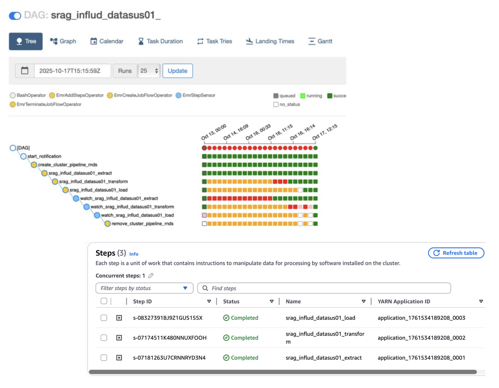

# Alan Muniz - Portfólio SPA Bilíngue

Um portfólio moderno, responsivo e bilíngue (PT-BR/EN-US) desenvolvido com HTML, CSS e JavaScript vanilla.

## 📄 Informações Atualizadas

Este portfólio foi personalizado com as informações de **Alan Brito Muniz**, Engenheiro de Dados com experiência em:
- Engenharia de Dados e Big Data
- Pipelines ETL/ELT com Python e Apache Spark
- Power BI e Analytics
- AWS (S3, Glue, EMR, RedShift)
- Gestão de Projetos e Metodologias Ágeis

## Como Personalizar

### 1. Adicionar suas Fotos

**Passo a passo:**

1. **Crie uma pasta chamada `images`** na raiz do seu repositório (mesmo nível que `index.html` e `style.css`)

```
seu-repositorio/
├── index.html
├── style.css
├── README.md
└── images/          ← Crie esta pasta
    ├── perfil.jpeg
    ├── project-1.png
    ├── project-2.png
    ├── edu-1.png
    └── cert-1.png
```

2. **Coloque suas fotos dentro da pasta `images`**
   - Foto de perfil: `perfil.jpeg` (recomendado: 500x500px)
   - Imagens de projetos: `project-1.png`, `project-2.png`, etc. (recomendado: 800x600px ou 16:9)
   - Diplomas: `edu-1.png`, `edu-2.png`, etc. (recomendado: 800x600px)
   - Certificados: `cert-1.png`, `cert-2.png`, etc. (recomendado: 800x600px)

3. **Pronto!** As fotos aparecerão automaticamente no seu portfólio

### 2. Atualizar Projetos

Procure pela seção `<!-- Projects Section -->` no `index.html` e siga o padrão:

```html
<div class="project-card">
  <div class="project-image">
    
  </div>
  <div class="project-content">
    <h3 class="project-title" data-pt="Nome do Projeto" data-en="Project Name"></h3>
    <p class="project-description" data-pt="Descrição em português" data-en="Description in English"></p>
    <div class="project-tech">
      <span class="tech-tag">Tecnologia 1</span>
      <span class="tech-tag">Tecnologia 2</span>
    </div>
    <a href="https://github.com/seu-usuario/seu-projeto" target="_blank" class="project-link">
      <i class="fab fa-github"></i>
      <span data-pt="Ver no GitHub" data-en="View on GitHub"></span>
    </a>
  </div>
</div>
```

**Importante:**
- Substitua `https://github.com/seu-usuario/seu-projeto` pelo link do seu repositório
- Adicione as imagens dos projetos na pasta `images/` com nomes como `project-1.png`, `project-2.png`, etc.
- Atualize o texto em português (data-pt) e inglês (data-en)

### 3. Adicionar suas Experiências

Procure pela seção `<!-- Experience Section -->` e siga o padrão:

```html
<div class="timeline-item" data-aos="timeline-reveal">
  <div class="timeline-dot"></div>
  <div class="timeline-content">
    <div class="timeline-header">
      <h3 class="exp-title" data-pt="Seu Cargo" data-en="Your Position"></h3>
      <span class="exp-period" data-pt="2024 – Atual" data-en="2024 – Present"></span>
    </div>
    
    <h4 class="exp-company">Sua Empresa</h4>
    
    <p class="exp-description" data-pt="Descrição em português" data-en="Description in English"></p>
    
    <div class="tech-tags">
      <span class="tech-tag">Tecnologia 1</span>
      <span class="tech-tag">Tecnologia 2</span>
    </div>
  </div>
</div>
```

### 4. Adicionar sua Educação/Graduação

Procure pela seção `<!-- Education Section -->` e siga o padrão:

```html
<div class="education-card">
  <div class="edu-image">
    
  </div>
  <div class="edu-info">
    <h3 class="edu-title" data-pt="Nome do Curso" data-en="Course Name"></h3>
    <p class="edu-institution" data-pt="Instituição" data-en="Institution"></p>
    <p class="edu-period" data-pt="Conclusão: Ano" data-en="Graduation: Year"></p>
  </div>
</div>
```

### 5. Adicionar suas Certificações

Procure pela seção `<!-- Certifications Section -->` e siga o padrão:

```html
<div class="certification-card">
  <div class="cert-image">
    
  </div>
  <div class="cert-info">
    <h3 class="cert-title" data-pt="Nome da Certificação" data-en="Certification Name"></h3>
    <p class="cert-issuer" data-pt="Emitido por: Instituição" data-en="Issued by: Institution"></p>
    <p class="cert-date" data-pt="Data: Mês Ano" data-en="Date: Month Year"></p>
  </div>
</div>
```

### 6. Atualizar Email e Links Sociais

Procure pela seção de **Contato** e atualize:

```html
<a href="mailto:seu-email@gmail.com">seu-email@gmail.com</a>
```

E os links do WhatsApp, LinkedIn e GitHub:

```html
<a href="https://wa.me/seu-numero" target="_blank">
<a href="https://www.linkedin.com/in/seu-usuario" target="_blank">
<a href="https://github.com/seu-usuario" target="_blank">
```

## 🌐 Fazer Deploy no GitHub Pages

1. **Crie um repositório no GitHub** (ex: `portfolio`)
2. **Faça upload dos arquivos** para o repositório:
   - index.html
   - style.css
   - README.md
   - pasta images/ com suas fotos

3. **Ative GitHub Pages:**
   - Vá em Settings → Pages
   - Selecione "Deploy from a branch"
   - Escolha "main" como branch
   - Clique em Save

4. **Seu portfólio estará em:** `https://seu-usuario.github.io/portfolio`

## 🎨 Personalizar Cores

Abra `style.css` e procure por cores azuis (`#3b82f6`, `#1e40af`, `#60a5fa`). Você pode substituir por suas cores preferidas:

```css
:root {
  --primary-color: #3b82f6;      /* Azul principal */
  --primary-dark: #1e40af;       /* Azul escuro */
  --primary-light: #60a5fa;      /* Azul claro */
}
```

Algumas alternativas:
- **Verde**: `#10b981`, `#059669`, `#34d399`
- **Roxo**: `#a855f7`, `#7c3aed`, `#d8b4fe`
- **Vermelho**: `#ef4444`, `#dc2626`, `#f87171`
- **Laranja**: `#f97316`, `#ea580c`, `#fed7aa`

## ✨ Funcionalidades

✅ Bilíngue (PT-BR / EN-US)  
✅ Timeline animada nas experiências  
✅ Seção de Projetos com imagens e links do GitHub  
✅ Seção de Educação com imagens de diplomas  
✅ Seção de Certificações com imagens  
✅ Estatísticas com links para seções  
✅ Contato com WhatsApp, Email e Links Sociais  
✅ Navegação suave e ativa  
✅ Design responsivo (mobile, tablet, desktop)  
✅ Sem dependências externas  
✅ Pronto para GitHub Pages  

## 📝 Estrutura de Arquivos

```
portfolio/
├── index.html          # Estrutura HTML + JavaScript
├── style.css           # Estilos e animações
├── README.md           # Este arquivo
└── images/
    ├── perfil.jpeg     # Sua foto de perfil
    ├── project-1.png   # Imagem do Projeto 1
    ├── project-2.png   # Imagem do Projeto 2
    ├── project-3.png   # Imagem do Projeto 3
    ├── project-4.png   # Imagem do Projeto 4
    ├── project-5.png   # Imagem do Projeto 5
    ├── edu-1.png       # Diploma Graduação
    ├── edu-2.png       # Diploma Técnico
    ├── edu-3.png       # Diploma Pós-graduação 1
    ├── edu-4.png       # Diploma Pós-graduação 2
    ├── edu-5.png       # Diploma Pós-graduação 3
    ├── cert-1.png      # Certificação 1
    ├── cert-2.png      # Certificação 2
    ├── cert-3.png      # Certificação 3
    ├── cert-4.png      # Certificação 4
    ├── cert-5.png      # Certificação 5
    └── cert-6.png      # Certificação 6
```

## 🔧 Dicas Extras

- **Para mudar o idioma padrão**: No `index.html`, procure por `let currentLanguage = localStorage.getItem('portfolio-language') || 'pt';` e mude `'pt'` para `'en'`
- **Para adicionar mais projetos**: Copie um card de projeto e adapte o HTML
- **Para mudar a fonte**: No `index.html`, procure por `<link href="https://fonts.googleapis.com/...">` e escolha outras fontes do Google Fonts
- **Para adicionar mais seções**: Copie uma seção existente e adapte o HTML

## 📞 Suporte

Se tiver dúvidas, consulte a documentação do GitHub Pages: https://docs.github.com/en/pages

---

**Desenvolvido com ❤️ para seu portfólio profissional**
